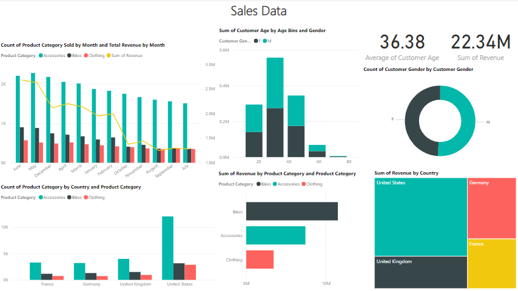

# Sales Data for Economic Data Analysis

This repository contains an analysis of a sales dataset aimed at exploring economic data through various analytical techniques.

## Dataset Description

The dataset is in a tabular format (XLSX) with the following columns:
- **Year**: The year of the sales transaction.
- **Month**: The month of the sales transaction.
- **Customer Age**: Age of the customer making the purchase.
- **Customer Gender**: Gender of the customer.
- **Country**: Country where the transaction occurred.
- **State**: State where the transaction occurred.
- **Product Category**: The main category of the purchased product.
- **Sub Category**: The sub-category of the purchased product.
- **Quantity**: The number of units sold.
- **Unit Cost**: Cost of one unit of the product.
- **Unit Price**: Selling price of one unit of the product.
- **Cost**: Total cost (calculated as Unit Cost * Quantity).
- **Revenue**: Total revenue (calculated as Unit Price * Quantity).

## Notebook Overview

The Jupyter Notebook (`fast-sales-data-for-economic-data-analysis.ipynb`) in this repository walks through the following steps:

### 1. **Data Loading and Inspection**
   - Loading the XLSX data into a pandas DataFrame.
   - Checking for missing values, duplicates, and incorrect data types.

### 2. **Data Cleaning**
   - Handling missing values (`NaN`) and incorrect spellings.
   - Removing duplicates and correcting data types (e.g., converting dates).
   - Using bins for categorizing customer ages.

### 3. **Exploratory Data Analysis (EDA)**
   - Understanding the distribution of sales, costs, and revenues.
   - Visualizing sales trends over time using Power BI.
   - Analyzing customer demographics (age, gender, country) and how they affect sales.

## Screenshot



### 4. **Insights and Summary**
   - Insights on customer behavior based on age, gender, and region.
   - Trends in product categories and their contribution to total sales and revenue.

### 5. **Saving the Results**
   - Exporting the cleaned and processed dataset to Excel for future use.

## Key Python Libraries Used
- `pandas`: For data manipulation and cleaning.
- `numpy`: For numerical operations.

## How to Run the Notebook
1. Clone the repository:
   ```bash
   git clone https://github.com/khnmaten13/Sales-Data-for-Economic-Data-Analysis.git
